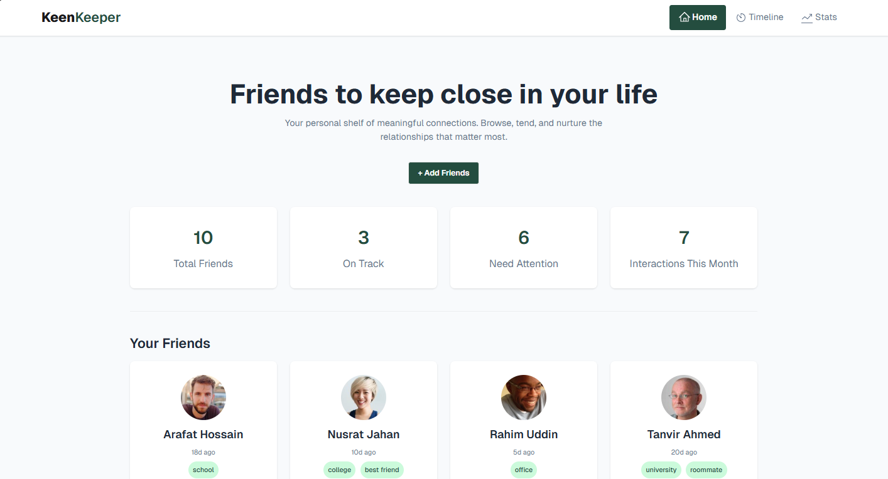

# 👥 KeenKeeper - Keep Your Friendships Alive

## 📖 Project Description

KeenKeeper is a React-based web application that helps you track and maintain your friendships by logging interactions like calls, texts, and video chats.

## 🛠️ Technologies Used

- React.js
- React Router DOM
- Tailwind CSS + DaisyUI
- Recharts
- React Hot Toast

## ✨ Key Features

1. **Friend Management** - Add, view, and manage friend profiles
2. **Interaction Tracking** - Log calls, texts, and video calls with timestamp
3. **Analytics Dashboard** - Visualize interaction patterns with pie charts
4. **Timeline Filtering** - Filter interactions by type (Call/Text/Video)

[## 🚀 Live Demo](https://keen-keeper-eight.vercel.app/)
